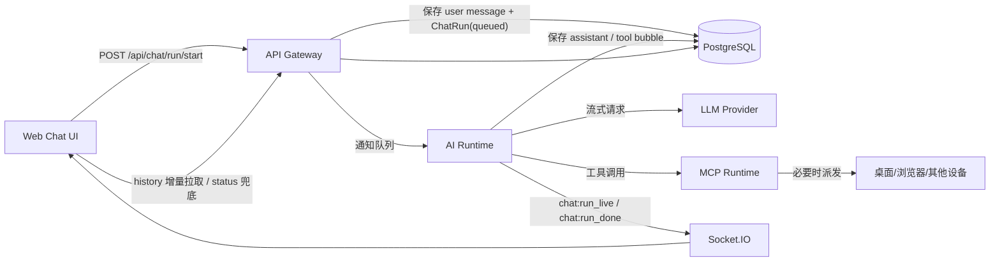
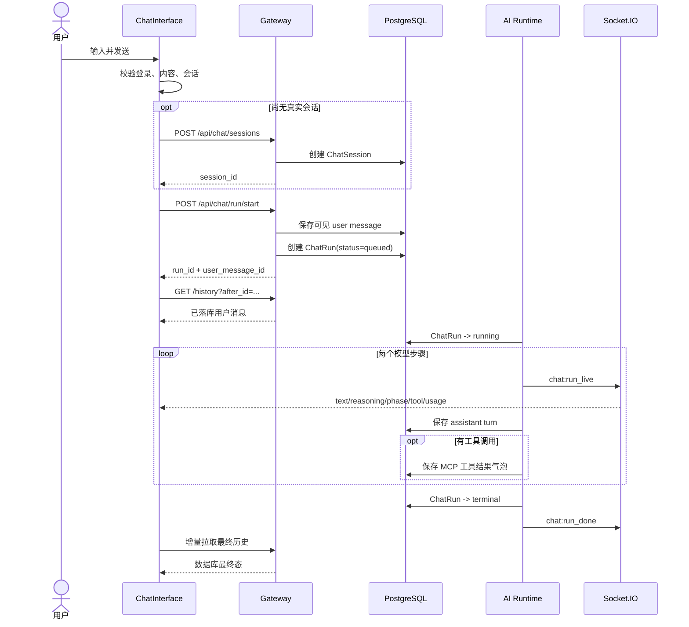
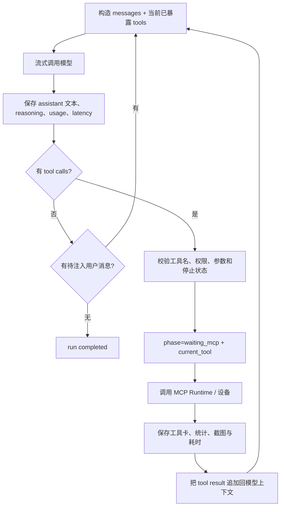

# AI 对话功能 UI 与运行逻辑参考设计

> 适用项目：HeySure AI 2.0，以及希望复刻同类 Agent 对话体验的新项目  
> 文档类型：产品 UI、前端状态、后端运行时、MCP 工具、对话历史、前置 Prompt 的一体化设计参考  
> 基准代码：2026-08-08 工作区当前实现  
> 说明：文中“现有实现”描述 HeySure 当前行为；“推荐方案”是在复刻时建议保留或补强的设计。

## 1. 目标与边界

本设计面向的不是一个只会返回文本的聊天框，而是一个能够：

- 管理多个 AI 与多个会话；
- 实时显示回答、深度思考、运行阶段和耗时；
- 让模型调用服务端、桌面端、浏览器等 MCP 工具；
- 在工具执行后继续推理，直到自然结束或达到保护条件；
- 在刷新页面、切换会话或网络短暂中断后恢复当前运行；
- 长期保存历史，同时控制上下文长度；
- 让用户看到“模型实际收到的前置 Prompt”；
- 支持生成中继续发消息、主动停止、撤回与删除。

非目标：本文不展开模型供应商配置、设备注册协议、任务系统与 AI 间通信的完整实现，仅说明它们与聊天主链路的接口边界。

## 2. 现有实现索引

| 领域 | 当前关键实现 |
| --- | --- |
| 聊天总组件 | [`ChatInterface.vue`](../../deploy/web/src/components/chat/ChatInterface.vue) |
| 输入框 | [`ChatInput.vue`](../../deploy/web/src/components/chat/ChatInput.vue) |
| 消息编排 | [`ChatConversationView.vue`](../../deploy/web/src/components/chat/ChatConversationView.vue) |
| 消息列表与活动分组 | [`ChatMessageList.vue`](../../deploy/web/src/components/chat/ChatMessageList.vue)、[`ChatActivityGroup.vue`](../../deploy/web/src/components/chat/ChatActivityGroup.vue) |
| 单条消息显示 | [`ChatMessage.vue`](../../deploy/web/src/components/chat/ChatMessage.vue) |
| 实时 Socket | [`useChatRunStream.ts`](../../deploy/web/src/composables/useChatRunStream.ts) |
| 前端 API | [`chat.ts`](../../deploy/web/src/api/chat.ts) |
| Gateway 聊天动作 | [`chat_action_routes.py`](../../deploy/server/main/gateway/routers/chat_action_routes.py) |
| Gateway 历史与会话 | [`chat_history_routes.py`](../../deploy/server/main/gateway/routers/chat_history_routes.py) |
| Run/消息/会话模型 | [`chat.py`](../../deploy/server/main/api/models/chat.py) |
| Prompt 与工具范围组装 | [`chat_runtime_helpers.py`](../../deploy/server/main/api/chat_runtime/chat_runtime_helpers.py) |
| 实时状态推送 | [`chat_prompt_utils.py`](../../deploy/server/main/api/chat_runtime/chat_prompt_utils.py) |
| 推理与工具循环 | [`core.py`](../../deploy/server/main/ai_runtime/inference/core.py) |
| 流式协议适配 | [`chat_stream.py`](../../deploy/server/main/api/chat_runtime/chat_stream.py) |
| MCP 文本格式解析 | [`mcp_parser.py`](../../deploy/server/main/api/chat_runtime/mcp_parser.py) |
| 消息持久化 | [`chat_persistence.py`](../../deploy/server/main/api/services/chat/chat_persistence.py) |
| 运行中消息注入 | [`chat_inject.py`](../../deploy/server/main/api/services/chat/chat_inject.py) |
| MCP 历史重放 | [`mcp_session_context.py`](../../deploy/server/main/api/services/chat/mcp_session_context.py) |
| 对话压缩 | [`conversation_compress.py`](../../deploy/server/main/api/services/chat/conversation_compress.py) |
| 人格示例 | [`doc/prompt/`](../prompt/)；实际运行时真相源为用户 KnowledgeBase 的 `personas/` 与 `system/` |

## 3. 总体架构

当前设计把“开始运行”“实时观看”“最终落库”分开处理：



这套拆分的核心价值：

1. REST 请求只负责创建 run，不占用一个超长 HTTP 连接。
2. Socket 负责低延迟展示，但不是历史真相源。
3. PostgreSQL 保存消息与 run 终态，页面刷新后仍能恢复。
4. HTTP 状态轮询作为 Socket 断线兜底，而不是默认主通道。
5. AI Runtime 可以多步推理、多次调用工具，Gateway 不承担长任务。

## 4. UI 信息架构

### 4.1 桌面布局

```text
┌────────────────────────────────────────────────────────────────────┐
│ [当前会话 ▾]                     [待发送 N] [前置 Prompt] [设置] │
├────────────────────────────────────────────────────────────────────┤
│                                                                    │
│  用户消息                                               [撤回/删] │
│                                                   ┌─────────────┐  │
│                                                   │ 用户气泡    │  │
│                                                   └─────────────┘  │
│                                                                    │
│  ➣ 深度思考 1 次 · 工具调用 2 次                    [折叠活动组] │
│  │ 深度思考内容                                                     │
│  │ 🔧 browser_observe · 成功 · 1.2s                               │
│  │ 🔧 browser_action  · 失败 · 0.8s                               │
│                                                                    │
│  AI 最终回答（Markdown / 图片 / 行内动作卡）             [复制] │
│                                                                    │
│  ● 正在执行 browser_action · 12.4s                                │
│                                                                    │
├────────────────────────────────────────────────────────────────────┤
│ [+附件与工具] [输入消息……                              ] [发送/■]│
└────────────────────────────────────────────────────────────────────┘
```

顶部、内容区、输入区应各自稳定占位。内容区独立滚动，输入区不得随消息高度跳动；移动端应使用动态视口高度，避免软键盘遮挡输入框。

### 4.2 空白会话页

空白会话不应在用户只是切换 AI 时立即写数据库。现有实现采用“空白页 + 首条消息时延迟创建会话”：

- 中心显示品牌图、简短引导；
- 显示最近普通对话及 Token 数；
- 用户输入第一句话后创建真实 `session_id`；
- 初始名称为“新对话”，随后以首条消息前 28 个字符生成标题，超长时追加省略号；
- 用户仍可手动重命名。

这样可避免产生大量没有消息的空会话。

### 4.3 会话选择器

建议至少支持：

- 普通对话与任务对话分组；
- 当前会话标题、Token 总量；
- 新建、切换、重命名、删除、批量删除；
- 当前 run 存在时切换会话不丢失运行；
- 可选的机器人转发开关；
- 最近使用排序，默认以 `ChatSession.updated_at DESC` 返回。

### 4.4 输入区

输入区推荐行为与现有实现一致：

| 条件 | 主按钮 | Enter | Shift+Enter |
| --- | --- | --- | --- |
| 空闲且无内容 | 禁用 | 无操作 | 换行 |
| 空闲且有内容 | 发送 | 发送 | 换行 |
| 生成中且无内容 | 停止 | 不停止 | 换行 |
| 生成中且有内容 | 发送 | 注入当前 run | 换行 |
| 触屏设备 | 由按钮决定 | 换行 | 换行 |

输入框高度建议在 36px 至 146px 之间自动增长，超出后内部滚动。加号面板同时承担：

- 文件选择；
- 当前消息的 MCP 工具范围选择；
- 已选附件数量提示；
- 文件与工具组清空、刷新。

### 4.5 消息类型与视觉语义

不要只按 `role` 设计三种气泡。Agent 对话至少需要以下视觉类型：

| 类型 | 数据识别 | 推荐显示 |
| --- | --- | --- |
| 用户消息 | `role=user` | 右对齐主色气泡；附件用 chip；提供撤回/删除 |
| AI 正文 | `role=assistant` | 左对齐、Markdown、代码复制、图片预览 |
| 深度思考 | `assistant.think` 或实时 `reasoning` | 次要色、可折叠；不与最终答案混排 |
| MCP 工具结果 | `role=system` 且 `tags` 含 `mcp_tool_call` | 工具卡：名称、成功/失败、耗时、参数、结果、错误、截图 |
| 系统提示 | `role=system` 且非工具 | 中性/警告提示条，不伪装成 AI 回答 |
| 实时回答 | 本地虚拟消息 `id=-1` | 与 AI 正文一致，但显示流式光标/运行状态 |
| 前置 Prompt | 独立弹层或虚拟消息 `id=-2` | 等宽预览、复制按钮、来源说明 |
| 任务完成/阶段摘要 | 标签或内容前缀识别 | 独立回执；可显示任务总耗时 |

现有 UI 会把连续的“深度思考 + MCP 工具卡”合并成一个可折叠活动组，例如“深度思考 1 次 · 工具调用 2 次”。这比把每个内部步骤都渲染成大气泡更利于阅读。

### 4.6 实时状态文案

前端至少维护三个相互独立的概念：

- `runStatus`：`idle | queued | running | completed | error | stopped`；
- `runPhase`：`idle | generating | waiting_mcp`；
- `currentTool`：仅在 `waiting_mcp` 时有意义。

推荐文案：

| 状态 | 文案 |
| --- | --- |
| `queued` | 正在排队 |
| `running + generating`，无 reasoning | 正在生成 |
| `running + generating`，有 reasoning | 深度思考中 |
| `running + waiting_mcp` | 正在执行 `{tool}` |
| 有设备进度 | `{tool}` · 设备已接收 / `{progress message}` |
| `stopped` | 已停止 |
| `error` | 本轮运行失败，显示安全错误摘要与重试入口 |

总耗时、深度思考耗时与 MCP 耗时可分别统计。切换 `currentTool` 时要重置“当前工具耗时”，否则连续工具会显示累计时间。

### 4.7 自动滚动

推荐遵循“用户控制优先”：

- 用户距离底部小于约 36px 时视为跟随模式；
- 实时输出期间只在跟随模式自动滚到底；
- 用户向上滚动后立即暂停自动跟随；
- 加载旧历史时记录原 `scrollHeight` 与 `scrollTop`，插入后恢复视觉锚点；
- 首屏消息不足以产生滚动条时，后台继续加载旧页，直到可滚动或无更多数据；
- Markdown、图片等异步布局完成后可在短时间内做有限次数的底部校准。

### 4.8 视觉规格、响应式与可访问性

建议沿用“正文安静、状态明确、工具紧凑”的视觉方向：

| 元素 | 建议规格 |
| --- | --- |
| 正文 | 14px，行高 1.6；代码 12–13px 等宽字体 |
| 用户气泡 | 最大宽度 80%–88%，主色浅底或实色；圆角 16px |
| AI 正文 | 最大宽度 92%–95%，弱化容器边界，突出内容而非气泡 |
| 活动组 | 11–12px 次要文字，左侧 1px 时间线，默认展开、允许折叠 |
| 工具卡 | 成功用绿/中性色，失败用红色；不能只靠颜色，必须带文字/图标 |
| 系统提示 | 中性灰；警告用琥珀色；错误用红色提示条 |
| 输入框 | 圆角 16px，发送按钮 36px 圆形，点击热区不小于 40px |
| 弹层 | 最大高度约 70vh，内部滚动；浮动聊天用 Teleport 避免裁切 |

响应式规则：

- 小屏隐藏非关键统计，但保留会话名、停止按钮和工具运行状态；
- 会话选择器宽度不超过 `88vw`；
- 固定高度使用动态视口单位并提供 `vh` 回退；
- 触屏设备关闭只依赖 hover 的交互，Prompt 改为点击打开；
- 移动端降低常驻动画和毛玻璃效果，减少 GPU 与电量消耗；
- 输入框聚焦时监听 visual viewport，使输入区跟随软键盘。

可访问性要求：按钮有可读 `aria-label`，运行状态使用 `aria-live=polite`，错误提示可被读屏读取；折叠组使用原生 `details/summary` 或完整键盘语义；代码、参数和结果复制成功后给出非颜色反馈。

## 5. 前端组件和状态边界

推荐组件树：

```text
ChatPage / AgentPanel
└─ ChatInterface                 会话与 run 总编排
   ├─ ChatHeader                 会话列表与会话操作
   ├─ PromptPreviewPopover       前置 Prompt 预览
   ├─ ChatConversationView       规范化消息 + 临时实时消息
   │  └─ ChatMessageList         分组、耗时、列表事件
   │     ├─ ChatActivityGroup    思考与工具活动折叠组
   │     ├─ ChatMessage          单消息视觉分派
   │     └─ TypingIndicator      实时状态/思考
   └─ ChatInput                  文本、附件、工具范围、发送/停止
```

状态建议分四层：

1. **持久态**：`sessions`、`messages`、当前 `sessionId`，来自数据库接口。
2. **运行态**：`runId`、`runStatus`、`phase`、`currentTool`、实时文本与 reasoning。
3. **视图态**：滚动锚点、弹层、折叠状态、复制提示、输入框高度。
4. **本地恢复态**：尚未成功注入的后续消息队列，可保存在 `localStorage`，键必须包含 `aiKind + aiConfigId + sessionId`。

不要让 `ChatMessage` 组件发请求。组件只发出 `delete/recall/apply/revert` 事件，由 `ChatInterface` 或 composable 调用 API 并更新状态。

最小前端类型建议：

```ts
type RunStatus = 'idle' | 'queued' | 'running' | 'completed' | 'error' | 'stopped'
type RunPhase = 'idle' | 'generating' | 'waiting_mcp'

interface ChatMessageView {
  id?: number
  role: 'user' | 'assistant' | 'system'
  content: string
  displayText?: string
  think?: string
  tags?: string
  createdAt?: number
  model?: string
  tokenUsage?: { prompt: number; completion: number; total: number }
  latencyMs?: number
  blocks?: Array<TextBlock | ToolBlock | MediaBlock>
}

interface ActiveRunView {
  runId: string
  status: RunStatus
  phase: RunPhase
  currentTool: string
  liveText: string
  liveReasoning: string
  liveCursor: number
  startedAt?: number
  errorMessage?: string
}
```

若另起新项目，建议把当前 `ChatInterface` 中的职责拆成 `useChatSessions`、`useChatHistory`、`useChatRun`、`useChatComposer` 四个 composable；组件只消费稳定接口，实时对账逻辑集中在 `useChatRun`。

## 6. 发送消息逻辑

### 6.1 正常发送主流程



前端伪代码：

```ts
async function sendMessage(raw: string) {
  const visibleContent = raw.trim()
  if (!visibleContent || !token) return

  if (!sessionId) sessionId = await createSession('新对话')

  if (runIsActive) {
    await injectOrQueue(visibleContent)
    return
  }

  const readableFiles = selectedFiles.filter(isInsideAllowedRoot)
  const modelContent = joinVisibleTextAndAttachmentContext(visibleContent, readableFiles)

  setRunUi({ status: 'queued', phase: 'generating', isTyping: true })
  clearInputAndPreviousLiveBuffer()

  try {
    const started = await startRun({
      visible_content: visibleContent,
      model_content: modelContent,
      visible_tags: encodeAttachmentRefs(readableFiles),
      selected_mcp_tools: selectedToolNames,
      session_id: sessionId,
      session_name: currentOrAutoTitle,
      ai_config_id: aiConfigId,
      ai_kind: aiKind,
    })
    runId = started.run_id
    await fetchIncrementalHistory()
    startSocketOrPollingTracking()
  } catch (error) {
    restoreIdleOrErrorUi(error)
    if (isActiveRunConflict(error)) await recoverActiveRun()
  }
}
```

### 6.2 可见内容与模型内容分离

当前请求同时发送：

- `visible_content`：写入历史并给用户看的原始文字；
- `model_content`：实际进入本轮模型上下文的文字，可附加文件路径等运行上下文；
- `visible_tags`：保存附件引用等机器可读 UI 元数据。

这一设计能避免把内部路径说明直接污染用户气泡。安全要求：服务端不能盲信 `model_content` 中的路径，任何文件访问工具仍需做工作区边界检查与权限校验。

### 6.3 Gateway 启动 run

`POST /api/chat/run/start` 的关键顺序：

1. 鉴权并确定 `(user, aiKind, aiConfigId, sessionId)`。
2. 检查同一会话是否已有 `queued/running` run；有则返回 409。
3. 解析 `selected_mcp_tools`，去重并设置数量上限。
4. 用统一逻辑解析基础系统 Prompt。
5. 保存用户消息，得到稳定数据库 ID。
6. 创建唯一 `run_id` 和 `ChatRun(status=queued)`。
7. 把 `model_user_content`、系统 Prompt、当前用户消息 ID、工具范围等保存为 worker 参数。
8. 通知远程 AI Runtime，或在单体模式启动本地 worker。
9. 返回 `run_id`、`status`、`user_message_id`。

保存用户消息必须发生在创建 run 之前或与其处于同一可靠事务边界，这样用户点击发送后即使 worker 启动失败，输入仍可审计和重试。

### 6.4 生成中再次发送

现有方案优先调用 `POST /api/chat/run/inject`：

1. Gateway 查找同一会话的活动 run。
2. 有活动 run：把消息保存为普通用户消息，但临时带 `pending_user_inject` 标签。
3. AI worker 在每次 LLM 请求前，即一次推理或一次工具调用后的步骤边界，原子取出所有待注入消息。
4. 清除标签，再按到达顺序追加到当前 `convo`。
5. 清除标签使该消息在未来重建上下文时成为普通历史，并保证不会再次注入。
6. run 即将自然结束前再排空一次，覆盖“消息恰好在最后一次生成期间到达”的竞态。
7. worker 结束后的兜底逻辑会检查孤儿注入；若仍有待处理消息且无活动 run，自动创建续跑 run。

如果注入接口因网络或服务异常失败，前端才把内容写入按会话隔离的本地队列；本轮结束后合并成一条续发消息。UI 显示“待发送 N 条”。

### 6.5 停止

`POST /api/chat/run/{runId}/stop` 应：

- 校验 run 所有者；
- 设置 `stop_requested=true`；
- 对 `queued/running` 立即写入 `status=stopped` 和 `finished_at`；
- 清理实时内存状态；
- worker 在步骤边界和工具批次中持续检查停止标志；
- 前端停止轮询、清空实时气泡、保留已经持久化的中间消息。

停止不是回滚。已经执行的 MCP 副作用与已经保存的消息继续保留。

### 6.6 发送幂等建议

现有实现通过“单会话只允许一个活动 run”阻止大部分双击重复，但新项目建议再增加：

- 客户端生成 `client_message_id` 与 `idempotency_key`；
- `ChatMessage` 对 `(user_id, client_message_id)` 建唯一约束；
- `ChatRun` 保存 `trigger_message_id`；
- 重复 `run/start` 返回已有 run，而不是创建第二个；
- 发送按钮在请求返回前做短时互斥，但不要以 UI 禁用代替服务端幂等。

## 7. 实时流与最终一致性

### 7.1 Socket 事件

客户端连接 `/`，成功后发送：

```json
{"event":"ui:join","payload":{"userId":123}}
```

服务端向 `user_{id}` 房间推送：

```json
{
  "event": "chat:run_live",
  "payload": {
    "run_id": "run_xxx",
    "user_id": 123,
    "text": "正在增长的当前轮正文",
    "reasoning": "正在增长的当前轮思考",
    "phase": "generating",
    "current_tool": "",
    "prompt_tokens": 100,
    "completion_tokens": 20,
    "total_tokens": 120,
    "updated_at": 1780000000.0
  }
}
```

终态事件：

```json
{
  "event": "chat:run_done",
  "payload": {
    "run_id": "run_xxx",
    "status": "completed",
    "error_message": null,
    "session_id": "session_xxx",
    "ai_config_id": 7,
    "ai_kind": "assistant"
  }
}
```

`chat:run_live` 当前按约 80ms 节流；阶段或工具切换必须强制立即推送，避免工具状态等到下一段文字才出现。

### 7.2 HTTP 兜底

Socket 未连接时，使用：

- `GET /api/chat/run/status/{runId}?after={liveCursor}`：约 90ms 获取实时增量；
- `GET /api/chat/history?session_id=...&after_id=...`：约 900ms 获取已持久化中间消息；
- 会话级安全轮询：Socket 在线可放宽到约 3s，离线约 1.2s，用于发现其他设备或机器人启动的 run。

这些数字是当前实现参考，不应写死在协议中。生产环境可根据用户数、数据库压力与代理超时进行退避，并加入随机抖动。

### 7.3 turn 边界

一个 run 可以包含多次“模型回答 → 工具 → 再回答”。每个 assistant turn 会单独落库。前端用以下信号提前拉取历史：

- 实时 `text/reasoning` 从非空变为空：上一 turn 已保存；
- `phase` 从 `waiting_mcp` 回到 `generating`：工具结果已保存；
- `current_tool` 变化：有新的工具卡可拉取；
- 收到设备工具终态事件。

这样用户不必等整个 run 完成，已经结束的思考、回答片段和工具卡会尽早变成稳定历史。

### 7.4 去重与最终对账

前端必须把数据库消息视为最终态：

1. 增量消息先按数据库 `id` 去重。
2. 对 assistant 消息再按“去除工具标记后的可见正文”与实时/本地临时消息比较。
3. 数据库版本到达时，用它替换无 ID 的本地版本。
4. `chat:run_done` 后立即拉一次增量历史。
5. 若最终实时正文暂未出现在历史中，短间隔重试若干次。
6. 数据库仍延迟时才保留一个本地 assistant 气泡，避免用户看到答案消失。

不要直接把每个 token 追加成一条消息；实时回答应始终是一个可替换的临时视图。

## 8. API 契约参考

### 8.1 会话

```http
GET    /api/chat/sessions?ai_kind=assistant&ai_config_id=7
POST   /api/chat/sessions
PUT    /api/chat/sessions/{sessionId}
DELETE /api/chat/sessions/{sessionId}
```

创建请求：

```json
{"name":"新对话","ai_config_id":7,"ai_kind":"assistant"}
```

列表项：

```json
{
  "id":"session_...",
  "name":"分析线上故障",
  "total_tokens":12890,
  "forward_to_bot":false,
  "model_preset_id":""
}
```

### 8.2 历史

```http
GET /api/chat/history?session_id=...&ai_kind=assistant&ai_config_id=7&limit=30
GET /api/chat/history?...&before_id=100&limit=30
GET /api/chat/history?...&after_id=130
```

约定：

- 最新页和旧页都按“旧 → 新”返回；
- `before_id` 用于向上翻页；
- `after_id` 用于 run 期间拉取新增消息；
- 历史列表不返回体积很大的 `system_prompt`；
- Prompt 通过专用接口读取。

### 8.3 Run

```http
POST /api/chat/run/start
POST /api/chat/run/inject
GET  /api/chat/run/active?session_id=...
GET  /api/chat/run/status/{runId}?after=0
POST /api/chat/run/{runId}/stop
```

启动请求：

```json
{
  "visible_content":"请检查服务状态",
  "model_content":"请检查服务状态\n\n[已附加工作区文件]\n- logs/app.log",
  "visible_tags":"attachments:...",
  "selected_mcp_tools":["workspace.run+command","fs.read"],
  "session_id":"session_...",
  "session_name":"请检查服务状态",
  "ai_config_id":7,
  "ai_kind":"assistant"
}
```

### 8.4 Prompt 预览

```http
GET /api/chat/system-prompt-preview?ai_kind=assistant&ai_config_id=7&session_id=...
```

响应：

```json
{
  "prompt":"模型实际收到的完整 system prompt",
  "prompt_source":"last_run"
}
```

`prompt_source` 可为：

- `last_run`：读取本会话最近 assistant 消息持久化的真实 Prompt；
- `runtime_preview`：本会话尚未运行，按当前配置即时组装预览。

## 9. 工具调用逻辑

### 9.1 工具权限的四层边界

推荐把工具可用性理解为交集，而不是简单列表：

```text
本轮有效工具
= AI 配置允许工具
∪ 必需的系统内省工具
∪ 当前绑定且在线的端侧工具
∪ 必需的任务/通道工具
再经过：绑定过滤、旧别名清理、当前消息选择范围收窄
```

重要规则：用户在输入区选择工具组只能“缩小”AI 原有权限，不能授予原本没有的工具。工具执行前仍必须在服务端再次校验；不能因为工具出现在 Prompt 中就默认有权执行。

### 9.2 动态目录与渐进 Schema

现有实现把所有允许工具的“名称 + 短描述 + 风险标记”注入 `[动态 MCP 说明]`，但原生 function schema 默认只暴露：

- `mcp.describe+tool` 等内省工具；
- 本会话此前已经 describe 且 schema 版本仍一致的工具；
- 任务运行必须直接使用的少量工具。

模型先从目录定位工具，参数不明确时调用 `mcp.describe+tool`。成功返回后：

1. 将该工具加入本 run 的 `exposed_tool_allowlist`；
2. 把工具名与 `schema_version` 保存到 `ChatSession.described_tools_json`；
3. 后续 run 只有版本仍一致时才恢复暴露。

这能显著减少一次请求中携带的工具 schema 体积，又不让模型失去工具发现能力。

### 9.3 原生工具与文本协议

运行时支持两条路径：

- 原生路径：OpenAI/Anthropic 风格的 `tools`、`tool_calls`、`tool` role；
- 文本兼容路径：模型输出 `<mcp-call>{...}</mcp-call>`，服务端解析并把结果以用户消息形式反馈。

优先使用原生 function calling；文本格式只用于不支持原生工具的模型或网关。文本解析失败时应给模型一次格式修复提示，不能把工具标记从 UI 隐藏后直接结束，让用户误以为 AI 无故停止。

### 9.4 单个推理步骤



### 9.5 批量工具调用

模型一轮可返回多个独立 `tool_calls`。服务端应：

1. 保存包含全部调用的 assistant turn；
2. 在下一次模型请求前，为每个 `tool_call_id` 产生一个响应；
3. 当前实现按顺序执行这一批工具；
4. 完全相同的“工具名 + 参数”在同一批只执行一次，其余调用返回“重复调用已合并”；
5. 跨步骤连续重复同一整批调用时触发无进展保护，防止重复副作用与无限循环；
6. 清空上下文、压缩上下文、计划创建/编辑等控制流工具会提前结束本批，但必须先为剩余 call ID 补齐结果。

如果未来改成真正并行执行，只允许无依赖、无顺序要求且风险策略允许的工具并行；不要仅因模型设置了 `parallel_tool_calls=true` 就并行产生副作用。

### 9.6 工具结果持久化格式

当前工具卡以稳定文本结构保存为 `role=system, tags=mcp_tool_call`：

```text
[MCP工具]
工具: browser_observe
状态: 成功

[参数]
{"action":"snapshot"}

[结果]
{...}

[截图]
/api/chat/media/123/token
```

优点是旧客户端也能显示原文，缺点是解析依赖文本标记。新项目推荐增加结构化列或 `metadata_json`：

```json
{
  "kind":"tool_result",
  "tool":"browser_observe",
  "call_id":"call_xxx",
  "status":"success",
  "arguments":{},
  "result_preview":{},
  "error":null,
  "latency_ms":1200,
  "media":[{"type":"image","url":"..."}]
}
```

文本 `content` 可继续保留用于兼容和全文导出，但 UI 应优先消费结构化字段。

### 9.7 工具卡 UI

工具卡默认只显示一行摘要：

```text
🔧 页面观察     成功     1.2s     [展开]
```

展开后分区显示：

- 参数：格式化 JSON，可复制；
- 命令：若参数含 `command`，单独显示命令、工作目录、退出码、stdout、stderr；
- 结果：设置最大展示高度，支持复制与查看完整结果；
- 错误：红色区域，显示安全错误摘要；
- 截图：行内缩略图，点击查看原图；
- 设备进度：执行期间显示 task ID 关联的最新进度。

高风险工具应在执行前走独立确认流程。确认状态、执行主体和审计 ID 必须由服务端保存，不能只依赖前端弹窗。

### 9.8 工具循环终止条件

普通会话建议满足任一条件终止：

- 模型自然结束且没有工具调用、没有待注入消息；
- 用户停止；
- 达到最大步骤数；
- 连续上游错误达到阈值；
- 连续重复无进展达到阈值；
- 权限或协议错误达到保护阈值；
- 服务端内部错误。

达到步骤上限时应保存一条可见系统提示，而不是静默截断。

## 10. 对话历史方案

### 10.1 数据模型

当前最小模型分为三类：

**ChatSession**

- 用户、AI 配置、AI 类型；
- `session_id`、标题、创建/更新时间；
- 会话级模型预设；
- 机器人转发开关；
- 已 describe 工具及 schema 版本。

**ChatMessage**

- 所属用户、AI、会话；
- `role/content/think/tags`；
- 模型、Prompt/Completion/Total/Cache Token；
- 本 turn 实际 `system_prompt`；
- `finish_reason`、`latency`、`created_at`；
- 截图等二进制媒体用独立表保存并通过受控 URL 引用。

**ChatRun**

- 唯一 `run_id` 与会话归属；
- `queued/running/completed/error/stopped`；
- `stop_requested`、错误、起止时间、心跳；
- worker 恢复参数。

消息是展示与上下文的长期事实，run 是一次执行的生命周期。不要把二者合并成一张表。

### 10.2 首屏与向上分页

- 首次只拉最新 30 条；
- 返回顺序统一为旧到新；
- 向上滚动到阈值时用 `before_id` 拉更旧一页；
- 使用主键游标，不用高 offset；
- 插入旧页时保持滚动锚点；
- 若首屏不够高，自动补页；
- 切换会话时用请求 epoch 丢弃过期响应，避免慢请求覆盖新会话。

### 10.3 run 期间增量

前端记录当前最大消息 ID，使用 `after_id` 拉取新增数据。服务端按创建时间或 ID 升序返回。run 的实时 token 文本不直接写消息列表，只有 turn 或工具执行结束并持久化后才进入正式历史。

### 10.4 上下文重建规则

数据库历史不应原样全部回放给模型。当前规则值得保留：

- 跳过 `compressed_away`；
- 跳过仍带 `pending_user_inject` 的消息，避免“历史 + 注入队列”重复；
- 用户与 assistant 正文正常回放；
- 历史 assistant 的 `think` 不回放，避免 reasoning 累积和复述；
- MCP 工具卡重建为合法的 `assistant.tool_calls + tool` 消息对；
- 工具参数完整保留，历史结果正文按配置截短；
- 某些系统提示按规则重放为 user 消息；
- 阶段摘要保留，详细阶段过程可压缩掉。

### 10.5 对话压缩

当会话 Token 超过阈值时：

1. 选取旧消息，保留最近若干条原文；
2. 排除已经压缩的消息和普通工具系统卡；
3. 调模型生成 `[对话历史摘要]`；
4. 给被折叠消息增加 `compressed_away`，并把其计费汇总字段归零或改由独立 usage 表核算；
5. 把摘要保存为 `role=user, tags=conversation_summary`；
6. 当前内存上下文重建为 `system + summary + recent messages`；
7. 若处于任务阶段，重新注入当前阶段锚点。

压缩失败不能循环重试阻塞本轮；应在该 run 内标记一次失败并继续正常处理。

长期建议把“历史计费事实”和“当前上下文 Token”分开统计。被压缩消息不应导致历史账单消失。

### 10.6 删除、撤回与清空

- 删除单条：只删除目标消息及关联媒体，并重建统计；
- 撤回：删除目标消息及其后的同会话消息，把原内容返回输入框；
- 删除会话：删除会话消息、媒体、会话记录；
- 清空：必须明确作用域为当前 AI/当前会话或所有会话；
- 进行中的 run 不应允许无条件删除其触发消息，需先停止或使用版本/锁检查；
- 有外部设备副作用时，撤回消息不等于撤销工具行为。

### 10.7 推荐索引与约束

新实现建议至少有：

```text
ChatSession UNIQUE(user_id, ai_kind, ai_config_id, session_id)
ChatMessage INDEX(user_id, ai_kind, ai_config_id, session_id, id)
ChatRun UNIQUE(run_id)
ChatRun INDEX(user_id, ai_kind, ai_config_id, session_id, status, updated_at)
ChatRun 条件唯一：同一会话最多一个 queued/running（PostgreSQL partial unique index）
```

当前逻辑层已经检查活动 run，数据库条件唯一索引可进一步封住并发竞态。

## 11. 前置 Prompt 方案

### 11.1 目标

前置 Prompt 需要同时满足：

- 可维护：人格、系统规则、任务规则分层；
- 可审计：能知道某一轮实际用了什么；
- 不漂移：UI 预览与 AI Runtime 的真实输入由同一函数组装；
- 动态：工具目录、设备在线状态、角色名单、任务上下文可按本轮变化；
- 安全：客户端不能自行决定系统权限。

### 11.2 推荐分层

按从稳定到动态的顺序组装：

1. **平台底层规则**：安全、身份边界、输出协议。
2. **角色人格**：名称、职责、行为偏好、禁区。HeySure 当前从 KnowledgeBase `personas/<id>-<name>.md` 读取。
3. **用户/组织规则**：该用户的全局系统设置。
4. **AI 配置扩展**：例如数据库连接提示、MCP 开关状态。
5. **通道规则**：Web、QQ、飞书等来源特有约束。
6. **角色协作上下文**：数字社会成员名单与 `message.send+to` 使用说明。
7. **任务上下文**：任务目标、计划流程、当前阶段与结束标志。
8. **动态 MCP 目录**：本轮真实允许工具的名称、简介、风险标记。
9. **MCP 调用规则**：原生/文本协议与批量调用规则。
10. **本轮临时系统消息**：仅由受信服务端来源附加。

不要把工具目录拼进用户消息。它属于系统能力说明，应由服务端注入 system Prompt。

### 11.3 单一组装入口

HeySure 当前以 `build_runtime_system_prompt_and_tools()` 同时返回：

```python
(effective_system_prompt, effective_tool_allowlist)
```

Gateway 的 Prompt 预览与 AI Runtime 的真实推理都调用它。任何影响 Prompt 或工具范围的数据必须来自跨进程一致的数据库/文件真相源，不能读取仅存在于 Gateway 内存中的设备 Socket 注册表，否则预览与真实输入会不一致。

### 11.4 动态段替换，不要反复追加

每轮组装前先移除旧的动态段，再写入当前值：

```text
[数字社会成员名单]
...

[任务规划流程]
...

[动态 MCP 说明]
...

[MCP 批量调用]
...
```

这能防止同一段在多次运行后无限叠加，也能自动清理旧人格文件残留的过期规则。

### 11.5 Prompt 预览 UI

顶部提供“前置 Prompt”按钮：

- 悬停或点击打开宽弹层；
- 等宽、保留换行、可滚动；
- 提供复制；
- 显示来源：`上次真实运行` 或 `按当前配置预览`；
- 若用户在输入区选择了 MCP 范围，预览接口可带 `selected_mcp_tools` 显示本轮范围；
- 浮动聊天窗中用 Teleport 渲染到 `body`，避免被父容器圆角与 overflow 裁切。

历史消息接口不应重复返回每一条 assistant 的完整 `system_prompt`，它可能包含几十 KB 工具目录。专用预览接口优先读取最近一次真实 Prompt；没有历史时才即时组装。

### 11.6 Prompt 安全

- 客户端传入的 `system_messages` 只能在服务端授权场景使用，不能对普通用户开放任意 system 注入；
- 文件内容、网页内容、工具结果都视为不可信数据，不得提升为平台系统规则；
- 工具权限以服务端 allowlist 为准，Prompt 只是告诉模型能做什么，不是鉴权层；
- 持久化 Prompt 时对密钥、Authorization、Cookie、数据库密码做脱敏或避免注入秘密原文；
- Prompt 版本、组装来源与摘要应进入 run 审计信息；
- 推荐保存 `prompt_hash`，便于排查同配置不同结果。

## 12. 错误与恢复策略

| 场景 | UI 行为 | 服务端行为 |
| --- | --- | --- |
| `run/start` 409 | 提示已有运行并自动接入 | 返回现有冲突，不启动第二个 run |
| Socket 断线 | 保留实时气泡，切 HTTP 轮询 | run 继续执行 |
| 状态查询瞬时失败 | 显示非阻断提示，可退避重试 | 不擅自把 run 改终态 |
| 上游模型错误 | 历史显示系统错误提示 | 修复 tool 上下文或重试，连续 3 次后 error |
| 模型不支持图片 | 提示已降级，继续运行 | 移除图片内容并把降级反馈给模型 |
| 工具失败 | 工具卡红色，AI 可继续总结/改用其他工具 | 保存失败卡并把结构化错误反馈模型 |
| 页面刷新 | 加载历史并查询 active run | 从 ChatRun 与实时状态恢复 |
| 终态事件丢失 | 会话安全轮询发现终态 | DB 状态是真相源 |
| 最终消息落库稍慢 | 短重试后保留本地气泡 | 最终由增量历史对账 |
| 用户停止 | 立即退出运行 UI，保留已落库内容 | 设置 stopped，worker 边界退出 |

错误展示应使用安全摘要；上游完整响应、堆栈、密钥和请求头只进入受控日志。

## 13. 安全、权限与隐私

1. 所有 chat/session/run/message 查询都按 `user_id` 和 AI 作用域过滤。
2. `ai_config_id` 必须属于当前用户，不能只相信查询参数。
3. `session_id` 是业务标识，不是授权凭证。
4. Socket 加入 `user_{id}` 房间前必须使用已认证身份，不能仅信客户端传来的 userId。
5. MCP 执行前重新校验 AI 工具范围、设备绑定、在线状态和工具权限。
6. 文件附件转换为模型路径前做规范化与允许根目录检查；实际读取时再次检查。
7. 工具结果和 Prompt 中的秘密需要脱敏。
8. 图片与大文件使用随机 token、鉴权或短期签名 URL，不暴露本地绝对路径。
9. 删除消息时同步清理媒体，数据库外对象存储需要异步补偿任务。
10. 对发送、工具调用、Prompt 预览和历史导出设置速率限制与审计。

## 14. 可观测性

结构化日志建议统一包含：

```text
request_id, run_id, user_id, ai_config_id, ai_kind, session_id,
step, phase, provider, model, tool, tool_call_id, device_task_id,
status_from, status_to, latency_ms, prompt_tokens,
completion_tokens, total_tokens, error_code
```

关键指标：

- run 排队时长、首 token 延迟、总耗时；
- Socket 在线率与 HTTP 兜底占比；
- 每 run 模型步骤数和工具调用数；
- 工具成功率、P50/P95/P99 耗时、权限拒绝率；
- 重复调用合并与无进展保护次数；
- 消息持久化到 UI 可见的延迟；
- active run 恢复成功率；
- 历史首屏耗时、分页耗时与 Prompt 预览体积；
- 对话压缩次数、压缩前后 Token、失败率。

## 15. 测试清单

### 15.1 发送与实时流

- 首条消息延迟创建会话并自动命名；
- 连续点击发送只创建一个用户消息和一个 run；
- Socket 正常时不启动 90ms 轮询；
- Socket 断开后自动切换轮询，恢复连接后停止高频轮询；
- 实时正文、reasoning、工具阶段切换正确；
- `chat:run_done` 后最终历史替换临时气泡，无重复答案；
- 页面刷新后接回活动 run；
- 切换会话时旧请求不能覆盖新会话。

### 15.2 生成中发送与停止

- 生成中发送在下一步骤边界进入上下文；
- 多条注入按顺序消费且只消费一次；
- 注入恰好发生在自然结束前仍能被最终排空；
- worker 结束后孤儿注入会创建续跑；
- 注入 API 失败时本地队列持久化并在结束后续发；
- 停止后迟到实时事件不能把 UI 重新改成“生成中”；
- 停止不删除已经完成的工具卡。

### 15.3 工具调用

- 原生 tool call 与文本 `<mcp-call>` 均能执行；
- 无权限、未知工具、缺参数、超时、设备离线正确显示；
- 同批重复副作用调用只执行一次；
- 每个原生 `tool_call_id` 都有响应；
- 工具完成后下一轮模型能读取结果；
- 截图在工具卡显示且不会破坏原生 tool 消息连续性；
- describe 后 schema 跨 run 恢复，版本变化后失效；
- 当前消息工具选择只收窄权限。

### 15.4 历史与 Prompt

- 最新页、向上翻页、增量拉取顺序正确；
- 加载旧页保持滚动位置；
- 历史 API 不返回大 `system_prompt`；
- Prompt 预览与实际持久化 Prompt 一致；
- 动态 Prompt 段不重复叠加；
- 历史 assistant reasoning 不回放；
- 工具历史重建为合法 tool-call 对；
- 压缩后摘要可继续保持任务方向；
- 删除/撤回同步更新消息、媒体和 Token 统计。

## 16. 推荐实施顺序

### 阶段 1：最小可靠聊天

- `ChatSession/ChatMessage/ChatRun`；
- 会话 CRUD、历史最新页；
- `run/start/status/stop`；
- AI Runtime 流式生成；
- Socket live/done 与 HTTP 兜底；
- 刷新恢复 active run。

验收：纯文本聊天在断网重连、刷新和停止场景下不丢消息、不重复。

### 阶段 2：Agent 工具闭环

- 工具注册与服务端 allowlist；
- 原生 function calling；
- `waiting_mcp/current_tool`；
- 工具结果卡持久化；
- 工具结果回填模型并继续推理；
- 步数、错误、重复调用保护。

验收：一次 run 能完成“思考 → 工具 → 继续思考 → 最终答复”。

### 阶段 3：完整 UI 体验

- 活动分组、思考折叠、工具详情、截图；
- 附件与每消息工具范围；
- 生成中注入与本地兜底队列；
- 自动滚动、历史游标分页、消息对账；
- Prompt 预览。

### 阶段 4：长期运行与治理

- Prompt 文件真相源与版本；
- 动态工具目录和渐进 schema；
- 对话压缩；
- 权限确认、审计、脱敏；
- 运行指标、告警与容量治理。

## 17. 关键设计决策总结

如果只保留十条原则，应保留以下内容：

1. “创建 run”与“等待 run”分离，长推理不占 Gateway HTTP 连接。
2. Socket 是实时通道，数据库历史是最终真相，HTTP 是恢复兜底。
3. `ChatMessage` 与 `ChatRun` 分表，消息事实和执行生命周期分离。
4. 正文、reasoning、工具结果是不同视觉对象，不塞进一个大文本气泡。
5. 生成中消息在步骤边界注入，既不中断当前工具，也不必等整个 run 完成。
6. 工具展示、模型目录和执行权限分层；客户端选择只能缩权。
7. 工具结果持久化，并在下一轮以合法 tool-call 对回放给模型。
8. Prompt 预览与真实推理调用同一组装函数，最近真实 Prompt 优先于重新推导。
9. 历史按游标分页；实时临时消息到达数据库版本后必须对账去重。
10. 对话压缩保留摘要与近期原文，不回放旧 reasoning，不让上下文无限增长。

按这套结构实现后，聊天功能才不仅“看起来像 AI 对话”，而是具备可恢复、可审计、可调用工具、可长期运行的 Agent 对话基础设施。
